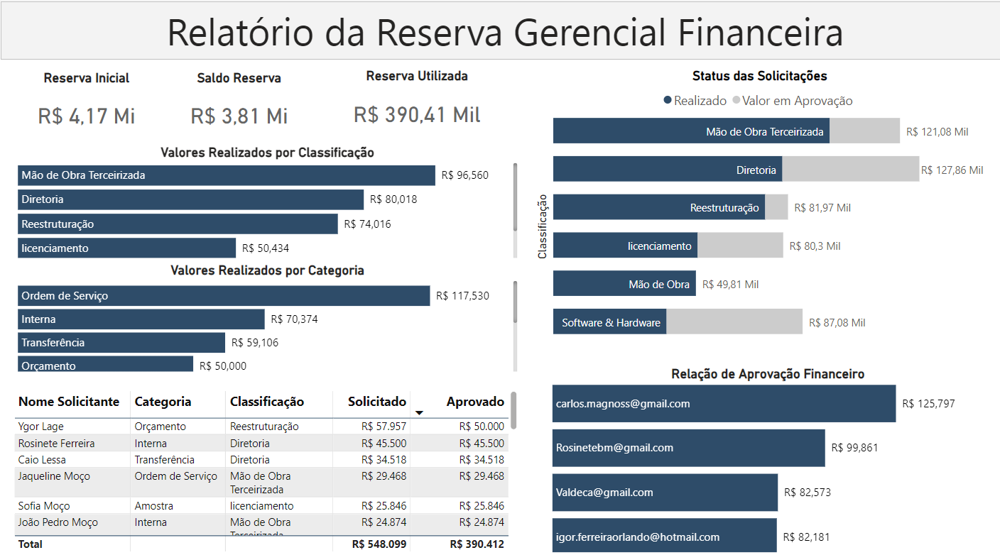
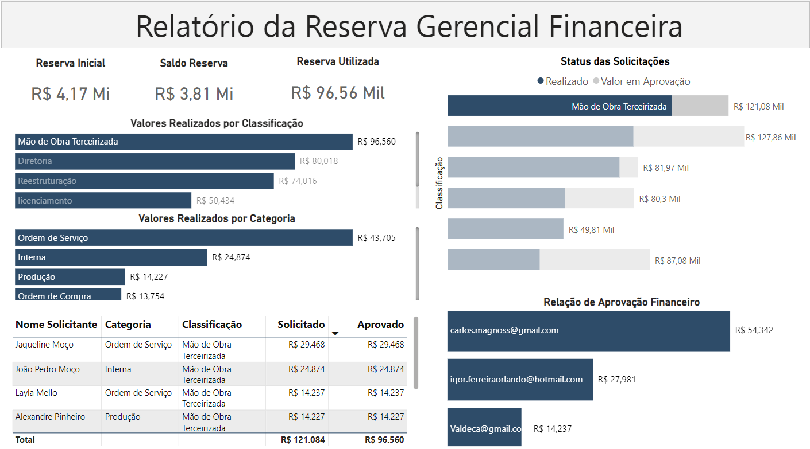
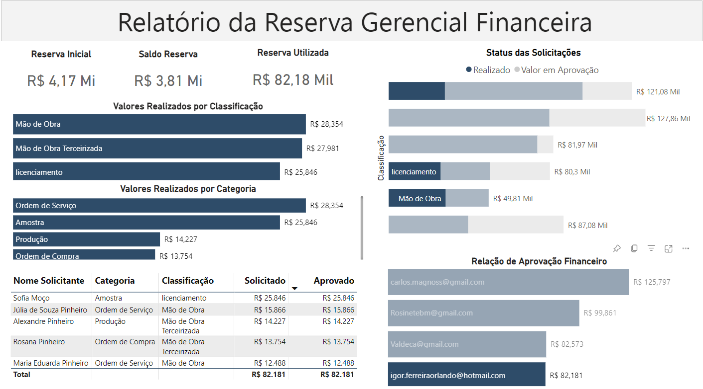
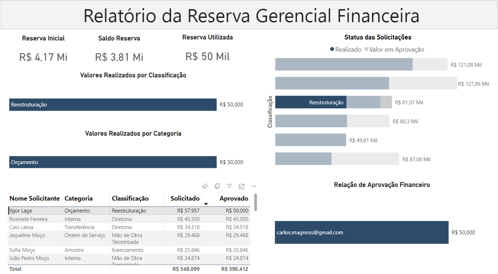
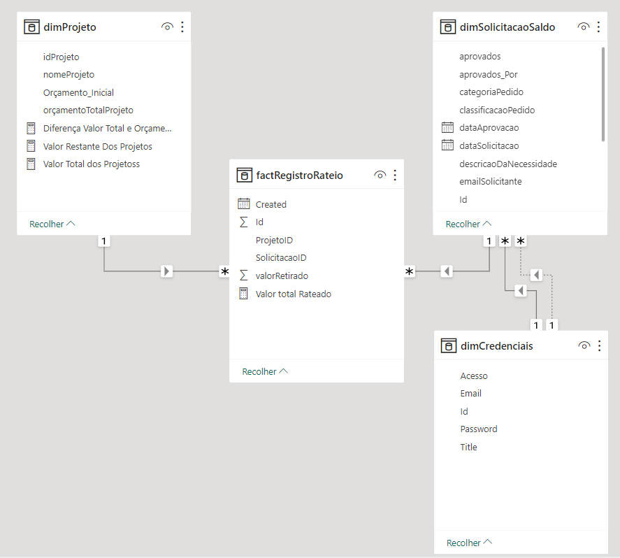

# PowerBi-ReservaFinanceira-

💡 Identificamos uma necessidade crucial de informações estratégicas na alta administração da organização. Enquanto nosso aplicativo anterior atendeu à equipe financeira, agora estamos direcionando nossos esforços para fornecer informações claras e precisas ao Diretor Financeiro.

Este relatório oferece uma visão completa, de alto nível, das reservas e seu uso, essencial para tomadas de decisões estratégicas. Ele visa responder a perguntas cruciais:

  
• Quanto de nossas reservas financeiras foi utilizado até agora?

  
• Como os fundos foram alocados em diferentes categorias de gastos?

  
• Quem na organização foi o destinatário desses fundos?

  
• Quem da equipe financeira autorizou essas alocações?

📈 Com a implementação deste relatório, antecipamos um melhor entendimento e controle sobre o uso das reservas financeiras. Isso permitirá ao Diretor Financeiro tomar decisões mais informadas e estratégicas. Além disso, a clareza nas informações fornecidas pelo relatório agilizará a comunicação com outros departamentos e partes interessadas.

Nesse projeto, consolidei dados do SharePoint para criar visualizações no Power BI, apresentando informações relevantes de forma impactante.

# Os Graficos que permitem essa visualização, são:

Gráfico de Alocação por Categoria de Gastos:

Destaca como os recursos foram alocados entre as várias categorias de despesas. Ele revela quais categorias receberam a maior parcela dos recursos e quais podem demandar uma redistribuição de verbas. Identifica prioridades e áreas que requerem uma análise mais aprofundada.

Gráfico de Desempenho por Categoria de Gastos:

Examina o desempenho das diferentes categorias de despesas. Ele fornece uma visão de quais áreas estão obtendo resultados superiores e quais podem necessitar de ajustes nas alocações para otimizar o uso dos recursos.

Tabela de Detalhes dos Requisitantes:

Disponibiliza informações detalhadas sobre os solicitantes, os montantes solicitados e os montantes efetivamente aprovados. Através desta tabela, é possível identificar tendências nos pedidos de recursos por diferentes solicitantes e compará-los com as alocações reais, contribuindo para a avaliação da eficácia da distribuição.

Gráfico de Execução vs. Orçamento:

Compara os valores efetivamente alocados com os valores inicialmente requisitados. Ele revela quão bem as alocações estão atendendo às demandas iniciais. Grandes discrepâncias podem sinalizar a necessidade de ajustes na estratégia de alocação de recursos.

Gráfico de Responsabilidade na Distribuição de Recursos:

Identifica os responsáveis pela distribuição dos recursos. Ajuda a esclarecer se a atribuição é centralizada em uma única pessoa ou se a responsabilidade é compartilhada entre vários agentes. Isso é fundamental para garantir transparência e prestação de contas na gestão dos recursos.

Gráfico de Impacto das Medidas de Redução de Gastos:

Ilustra como as ações que visam diminuir o montante total solicitado impactam a alocação efetiva de recursos. Ele permite visualizar as mudanças na distribuição de verbas e mostra o efeito das medidas de redução de gastos sobre o processo de alocação de recursos.

# Os filtros complementam a visualização:

# Os Relacionamentos das listas

🚀 Essas informações fornecem insights valiosos para a empresa. Aqui estão alguns dos insights que se destacam:

  
• Transparência Financeira

  
• Otimização de Recursos

  
• Alocação Baseada em Dados

  
• Rastreamento e Responsabilidade

  
• Agilidade nas Tomadas de Decisão

  
• Demonstração de Inovação

  
• Aprendizado Contínuo

 

No geral, as análises sugerem que o projeto de gerenciamento de reserva financeira está alinhado com suas metas e está em boa forma. Recomenda-se manter a transparência, monitorar continuamente a eficiência e considerar a expansão do programa para atender às demandas futuras.

Agradeço a sua atenção até aqui, nos vemos no proximo projeto.

